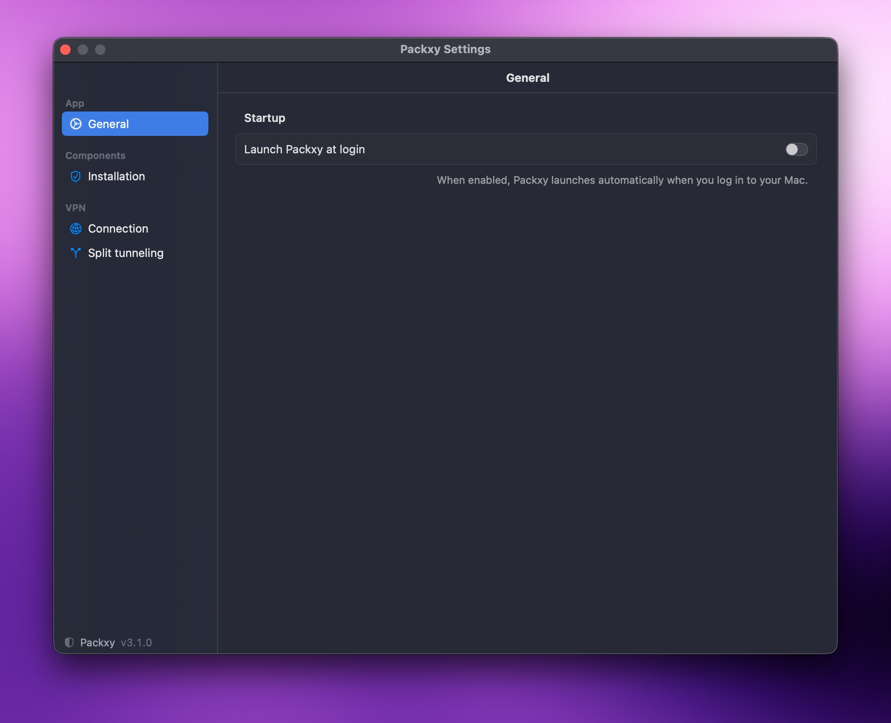
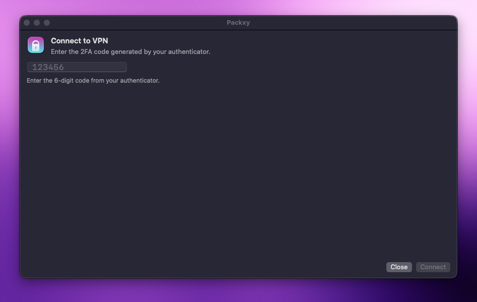

# Packxy

macOS split tunneling for FortiGate VPN, packaged as a native menu-bar
app. Runs `openfortivpn` natively on the host, creating a `ppp0`
interface, then routes only your internal IP ranges through the VPN —
everything else stays direct.

## How it works

```
 macOS host
 ─────────
   apps                                ┌──────────────────┐
    │                                  │  FortiGate VPN   │
    ├─ default route (en0/Wi-Fi)       │   gateway        │
    │  ────→ Internet                  └──────────────────┘
    │                                            ▲
    └─ specific routes (VPN_ROUTES)              │ TLS
       ────→ ppp0 ────→ openfortivpn ────────────┘
                       (subprocess spawned by Packxy.app)
```

Packxy is a Swift / SwiftUI menu-bar app (macOS 14+). It owns the
`openfortivpn` lifecycle, the split-tunnel routes / `/etc/resolver`
files, and the reconnect-on-drop flow. All protocols (SSH, Git, HTTP,
HTTPS, etc.) work transparently because `ppp0` is a real macOS kernel
interface.

The host's default route and `/etc/resolv.conf` are **not** modified:
only the configured CIDRs go through the VPN, only the configured
domains use the VPN DNS server (via `/etc/resolver/`).

### Split tunneling — four locks

Out of the box, `openfortivpn` and macOS would both try to put you in
**full-tunnel** mode. Packxy applies four layered controls to keep
traffic split:

**1. openfortivpn adds no routes, touches no DNS.**
The generated `/tmp/packxy/openfortivpn.conf` sets:
```
set-routes = 0          # openfortivpn does not modify the routing table
set-dns = 0             # openfortivpn does not modify /etc/resolv.conf
pppd-use-peerdns = 0    # openfortivpn does not ask pppd to import peer DNS
```

**2. pppd does not replace the default route.**
The pppd peer file at `/etc/ppp/peers/packxy` (written by the app's
Install button) contains:
```
230400                  # explicit baud rate (BSD pppd requirement on a pty)
nodefaultroute          # pppd must not become the default route
lcp-echo-interval 10    # keepalive ping every 10s
lcp-echo-failure 6      # declare link dead after 6 missed echoes (~60s)
```

**3. The default route is restored after pppd hijacks it.**
macOS' SystemConfiguration installs a default route via `ppp0` when
the interface comes up — even with `nodefaultroute`. Packxy captures
the original default route before launching openfortivpn and re-adds
it once `ppp0` is up, undoing the hijack.

**4. Explicit routes for VPN_ROUTES only.**
Packxy adds `route add -net <cidr> -interface ppp0` for each CIDR in
the configured `VPN_ROUTES`. Everything else continues to use the
host's normal default route.

## Install

1. Build the app (`make build` — see below) or grab a release.
2. Open `dist/Packxy.app` and grant macOS notification permission when
   prompted.
3. Click the Packxy menu-bar icon → **Settings…** → **Installation** →
   **Install…**. macOS asks for your admin password and writes:
   - `/etc/sudoers.d/packxy` — grants the current user passwordless
     sudo for `openfortivpn`, `pkill -x openfortivpn`, `route`, and
     `tee/rm/mkdir` on `/etc/resolver/*`.
   - `/etc/ppp/peers/packxy` — pppd peer file with the split-tunnel
     options.
4. Switch to the **Connection** pane and fill in: host, port,
   username, password (stored 0600 in `~/.config/packxy.conf`),
   optional realm / trusted cert.
5. Switch to **Split tunneling** and add at least one CIDR under
   *Routes*; optionally set the internal DNS server and the domains
   it serves.
6. Save.

Optional: **General → Launch Packxy at login** registers the app via
`SMAppService`; macOS will prompt once in System Settings → Login Items
to confirm.



## Use

- Click the menu-bar shield → **Connect…** → enter the 6-digit 2FA
  code from your authenticator → **Connect**.

  
- The menu bar shows the live state (`🟢 Connected · 10.x.x.x` /
  `🔴 Disconnected · 5m ago` / etc.) plus the active routes & split
  DNS domains.
- On drop (auth expired, network blip, wake from sleep), Packxy posts
  a notification and reopens the OTP prompt with a reason-tailored
  title.
- **Disconnect** from the menu bar tears down `ppp0`, removes the
  configured resolvers, and returns to a clean state.

## Config file

`~/.config/packxy.conf` (mode 0600) — godotenv-style KEY=VALUE. The
app reads and writes it; you can also edit it by hand:

```sh
FORTI_HOST=vpn.example.com
FORTI_PORT=443
FORTI_USER=jdoe
FORTI_PASS=…
FORTI_TRUSTED_CERT=        # optional sha256 fingerprint
FORTI_REALM=               # optional FortiGate realm
FORTI_NO_FTM_PUSH=         # "1" to pass --no-ftm-push
FORTI_OTP_PROMPT=          # optional openfortivpn prompt substring
VPN_ROUTES=10.0.0.0/8,172.16.0.0/12
VPN_DNS=10.0.0.1
VPN_DOMAINS=internal.example.com,corp.local
```

`FORTI_OTP` is **never** persisted — it's a 30-second single-use token
that has no business living in a file.

## Build

Requires macOS 14+, Xcode Command Line Tools (Swift 5.9+ shipped with
CLT 15.3 or later), and `openfortivpn` from Homebrew:

```sh
brew install openfortivpn
make build                          # → dist/Packxy.app (ad-hoc signed)
cp -R dist/Packxy.app /Applications/ # install into /Applications
make run                            # build + open the app
make clean                          # remove dist/, build/, Packxy/.build/
```

The Makefile uses `swift build` (SPM) to compile the executable and a
sips/iconutil pipeline to wrap it into a proper `.app` bundle with an
icon and `LSUIElement=YES` (menu-bar agent, no Dock tile). No full
Xcode required.

## Layout

```
Packxy/
  Package.swift               SPM manifest
  Info.plist                  bundle metadata template
  Sources/Packxy/
    PackxyApp.swift           @main App + scenes
    Core/                     ConfigStore, ConnectionManager,
                              OpenfortivpnDriver, NetworkConfig,
                              PowerObserver, Notifications, …
    UI/                       SettingsView, ConnectionWindow,
                              MenuBarContent, EditableList
assets/icon.png               source for AppIcon.icns
Makefile
README.md
```

## Uninstall

Settings → Installation → **Uninstall…** removes the sudoers drop-in
and the pppd peer file. Then drag `Packxy.app` to the Trash. The
config file at `~/.config/packxy.conf` is left in place — delete it by
hand if you want a clean slate.

## Troubleshooting

- **"VPN failed to start"** — check
  `cat /tmp/packxy/openfortivpn.log` for the openfortivpn output.
  If sudo refuses, reinstall the sudoers drop-in
  (Settings → Installation → Reinstall…). The drop-in template
  changed when split-DNS support was added; older installs need a
  refresh.
- **OTP rejected repeatedly** — Packxy stops after 4 failed attempts
  to avoid the FortiGate 5-attempt account lockout. Disconnect and
  reconnect manually when ready.
- **Menu-bar item gone after rebuild** — `pkill -f "Packxy.app"` and
  `open dist/Packxy.app` to relaunch.

## License

(unspecified)
